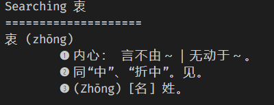
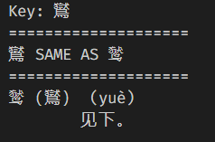

# 现某汉语词典Searcher

词典是网上找的（https://github.com/bamboo512/ModernChineseDict）

mdx分析库（pureSalsa20.py和readmdict.py和ripemd128.py）来自https://bitbucket.org/xwang/mdict-analysis/src/master/

## 安装

基于Python3，依赖于python-lzo与xmltodict

```shell
pip install python-lzo xmltodict
```
然后下载所有文件到工作文件夹即可

## 使用

引入包，确定字典路径
```python
import os
from searchercore import Searcher

MDX_PATH = 'PATH/TO/YOUR/DICT.mdx'
assert os.path.exists(MDX_PATH)
```
`MDX_PATH`为字典MDX格式文件的路径

然后创建一个searcher对象
```python
searcher = Searcher(MDX_PATH)
```

### 搜索模式

将搜索结果打印到屏幕：
```python
searcher.search(示例)
```
如果搜索不到，将在屏幕提示“No such key”

若想将搜索结果以字符串形式得到，使用`get()`方法：
```pythoon
result_string = searcher.get(示例)
```
如果搜索不到，将返回字符串`No such key`。`search()`方法是对`get()`方法的封装。

### 遍历模式

使用`search_all()`方法，将字典中所有可用词条展示在屏幕上（很耗时！）
```python
searcher.search_all()
```
本质是对词库中的所有词条调用`search()`方法

### 手气不错

使用`lucky()`方法，在词典中随机选取一个（或若干个）词条，在屏幕上展示
```python
searcher.lucky(6)
```

## 已知bug
- “同”、“见”同时出现时，只能正常显示第一个
    
- 部分“见下”词条不能正常显示
    

以上bug均可通过修改源代码，改变词条内容处理方式解决

## License

GPL v3